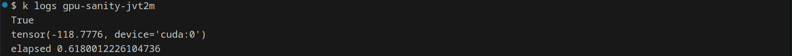
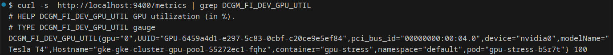
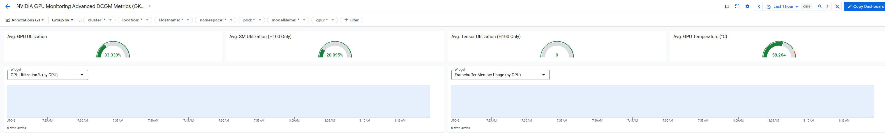

# GPU Workload on GKE: Quickstart Guide

This guide walks you through provisioning a GPU-enabled GKE cluster, running GPU workloads, and monitoring GPU usage with step-by-step instructions and visual evidence.

## Table of Contents
1. [Cluster Provisioning](#cluster-provisioning)
2. [Running GPU Workloads](#running-gpu-workloads)
3. [Monitoring GPU Usage](#monitoring-gpu-usage)
4. [Cleanup](#cleanup)

---

## Cluster Provisioning

Lets create a single zone GKE cluster with one node capable to use GPU, it will take about 10 min to be up and running:

1. **Configure Variables**
   ```bash
   cp terraform.tfvars.example terraform.tfvars
   # Edit terraform.tfvars and set your project_id and other values
   ```
2. **Authenticate with GCP**
   ```bash
   gcloud auth application-default login
   ```
3. **Initialize and Apply Terraform**
   ```bash
   terraform init
   terraform apply
   ```
4. **Update kubectl Config**
   ```bash
   gcloud container clusters get-credentials gke-cluster --region us-east4-b
   ```

---

## Running GPU Workloads

Deploy a GPU-intensive job to verify GPU access:

```bash
kubectl apply -f gpu-sanity-job.yaml
```

**Sample Job Output:**



*Note: The job completes quickly, making it difficult to observe GPU load.*

So, lets create a more intensive GPU job (it runs for 4 min)
```bash
kubectl apply -f gpu-stress-job.yaml
```
---

## Monitoring GPU Usage

Inspecting pods in our gke you can see a dcgm-exporter pod in our gke-managed-system namespace. That means DCGM (NVIDIA Data Center GPU Manager) metrics are enabled in our GKE cluster. 
The dcgm-exporter exposes Prometheus-style metrics on an HTTP endpoint (on port 9400 at the /metrics path)

1. **Check for dcgm-exporter Pod**
   ```bash
   kubectl get pods -A | grep dcgm-exporter
   ```

2. **Port Forward Metrics Endpoint**
   ```bash
   kubectl port-forward dcgm-exporter-bf6kg 9400:9400 -n gke-managed-system
   ```

3. **Query GPU Utilization**
   ```bash
   curl -s http://localhost:9400/metrics | grep DCGM_FI_DEV_GPU_UTIL
   ```

**Sample GPU Utilization Output:**



4. **View GPU Metrics in GCP Console**



---

## Cleanup

> **IMPORTANT:**
> 
> **Do not forget to destroy the GKE cluster after finishing the proof of concept to avoid unnecessary costs!**

---